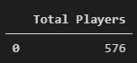
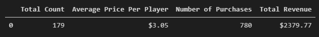
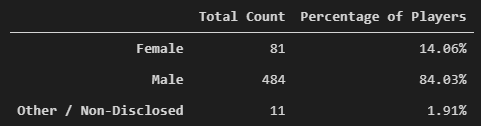
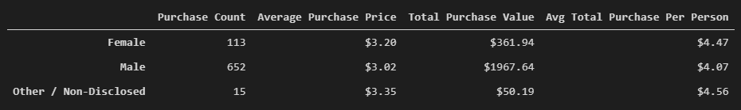
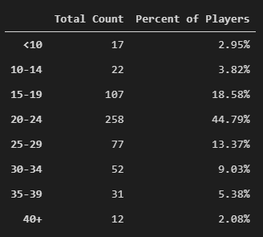
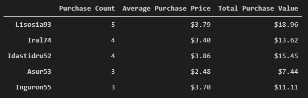
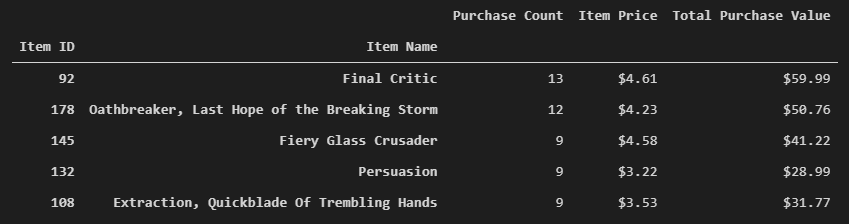
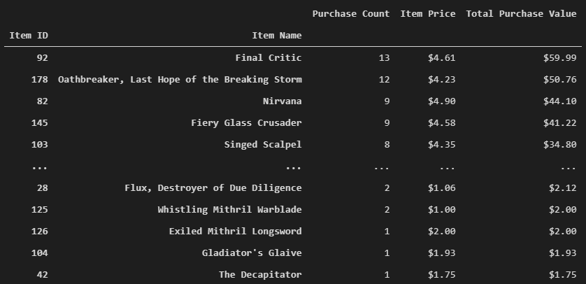

# Pandas-Video_Game_Data_Analysis
This [Game Analysis](Game_Analysis.ipynb) script examines the data for a fictitious free-to-play fantasy game. Players are able to purchase optional items that enhance their playing experience. This script generates a report that breaks down the game's purchasing data into meaningful insights.

The final report includes the following:  
### Player Count

* Total Number of Players

### Purchasing Analysis (Total)

* Number of Unique Items

* Average Purchase Price

* Total Number of Purchases

* Total Revenue

### Gender Demographics

* Percentage and Count of Male Players

* Percentage and Count of Female Players

* Percentage and Count of Other / Non-Disclosed

### Purchasing Analysis (Gender)

* Purchase Count

* Average Purchase Price

* Total Purchase Value

* Average Purchase Total per Person by Gender

### Age Demographics

* Purchase Count

* Average Purchase Price

* Total Purchase Value

* Average Purchase Total per Person by Age Group

### Top Spenders

* SN

* Purchase Count

* Average Purchase Price

* Total Purchase Value

### Most Popular Items

* Item ID

* Item Name

* Purchase Count

* Item Price

* Total Purchase Value

### Most Profitable Items

* Item ID

* Item Name

* Purchase Count

* Item Price

* Total Purchase Value
- - -

### Tech Stack

* Python
* Jupyter Notebook

### User Instructions

* Clone the repository: git clone https://github.com/DarrylB32/Pandas-Video_Game_Data_Analysis

* Open and execute [Game_Analysis](Game_Analysis.ipynb) file.

### Additional Notes

